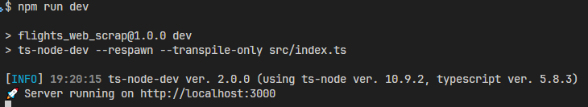
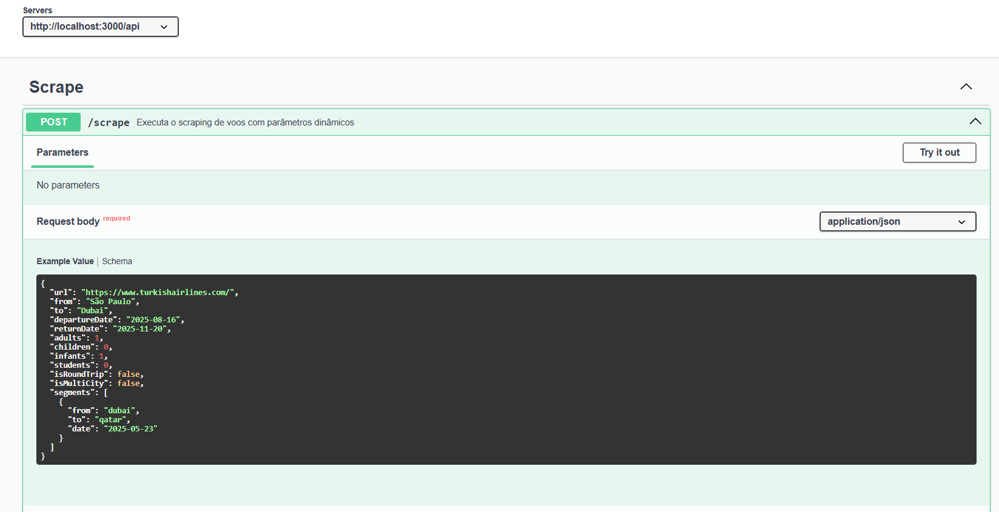
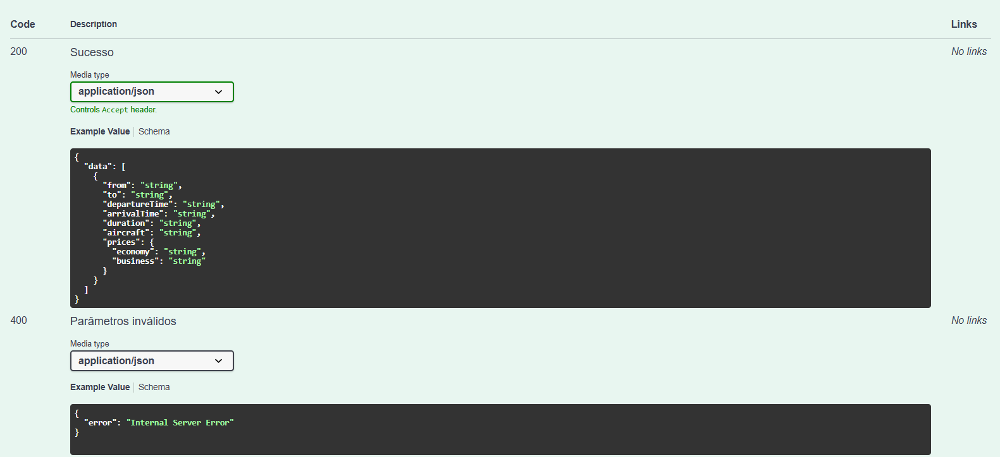
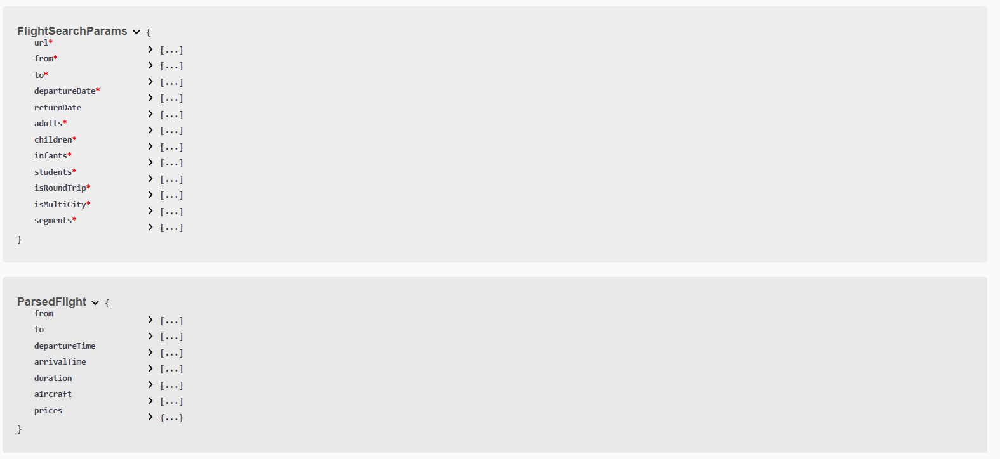
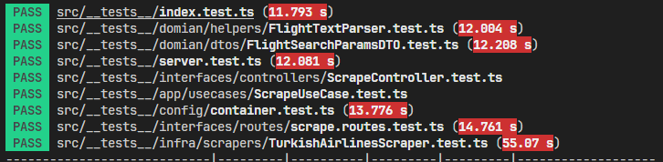
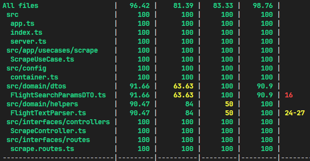
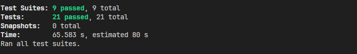

# flights_web_scrap

**A tool that gets flights information from the Turkish Airlines website, built with Clean Architecture.**

---

## 📦 Projeto

* **Name:** flights_web_scrap
* **Version:** 1.0.0
* **Descrição:** Coleta dados de voos (horários, aeronaves, duração e preços) diretamente do site da Turkish Airlines.
* **Arquitetura:** Clean Architecture (Domain, Application, Infrastructure, Interface).

---

## 📋 Requisitos

1. **Parâmetros mínimos de entrada:**

   * Data da viagem
   * Local de partida e destino
   * Número de passageiros (adultos, crianças e bebês)
   * Suporte para **ida e volta** e **multi-city**
2. **Funcionalidades:**

   * Scraping de preços de voos no site da Turkish Airlines
   * Extração e retorno de dados em JSON, contendo ao menos:
     * Código do voo
     * Aeroportos de origem e destino
     * Horários de partida e chegada
     * Companhia aérea
     * Preços (economy e business)
3. **Especificações técnicas:**

   * Implementação em **TypeScript** (ou Python, se preferir)
   * Uso de **Playwright** para automação de navegador
   * Projeto organizado em Clean Architecture
4. **Entregáveis:**

   * Código-fonte com comentários
   * Documentação de setup e instruções de uso para testes
5. **Critérios de avaliação:**

   * Qualidade e legibilidade do código
   * Precisão e confiabilidade da extração de dados
   * Conformidade com os requisitos especificados

---

## 🚀 Tecnologias Principais

* **Node.js & Express** : Servidor HTTP e roteamento.
* **TypeScript** : Tipagem estática.
* **Playwright** : Automação de navegador para scraping.
* **Swagger (OpenAPI)** : Documentação interativa via `swagger-ui-express`.
* **Jest & Supertest** : Testes unitários e de integração.

---

## 🎯 Scripts Úteis

Use `npm run <script>`:

| Script            | Descrição                                                                    |
| ----------------- | ------------------------------------------------------------------------------ |
| `dev`           | Inicia em modo desenvolvimento (reload automático via `ts-node-dev`).       |
| `build`         | Compila TypeScript para JavaScript em `dist/`.                               |
| `start`         | Executa a versão compilada (`node dist/index.js`).                          |
| `test`          | Roda todos os testes com Jest.                                                 |
| `test:watch`    | Roda Jest em modo watch, atualizando ao salvar.                                |
| `test:coverage` | Gera relatório de cobertura de testes.                                        |
| `postinstall`   | Instala binários do Playwright (executado automaticamente pós-instalação). |

---

## ⚙️ Instalação e Setup

1. Clone o repositório:

   ```bash
   git clone https://github.com/seu-usuario/flights_web_scrap.git
   cd flights_web_scrap
   ```
2. Instale dependências:

   ```bash
   npm install
   ```

   > O `postinstall` do Playwright instala automaticamente os navegadores necessários.
   >

---

## 🏃 Executando a Aplicação

* **Em desenvolvimento** :

```bash
  npm run dev
```

  Acesse `http://localhost:3000/api/docs` para ver a UI do Swagger.

* **Em produção** :

```bash
  npm run build
  npm start
```



---

## 📑 Documentação (Swagger)

Após iniciar em dev ou produção, abra no navegador:

```
http://localhost:3000/api/docs
```

Lá estão disponíveis todos os endpoints e schemas (incluindo `POST /api/scrape` com `FlightSearchParams`).







---

## 🔍 Testes

* **Rode todos os testes** :

```bash
  npm test
```

* **Limpe o cache do Jest antes de rodar** :

```bash
  npx jest --clearCache && npm test
```

* **Modo watch** :

```bash
  npm run test:watch
```

* **Cobertura** :

```bash
  npm run test:coverage
```

Os testes usam **Jest** e **Supertest** para cobrir rotas, parsers e utilitários.







---

## 📝 Contribuições

1. Fork este repositório
2. Crie uma branch: `git checkout -b feature/nome-da-feature`
3. Faça commits das suas alterações: `git commit -m "feat: descrição da feature"`
4. Envie para o repositório remoto: `git push origin feature/nome-da-feature`
5. Abra um Pull Request

---

*Desenvolvido por Lucas Antunes*
